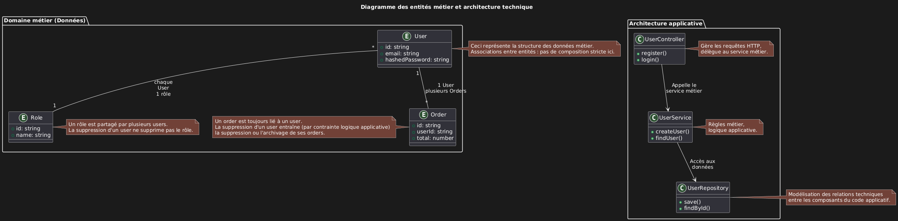

# Diagramme de Classes - Relations et Symboles PlantUML

## À propos de PlantUML

**PlantUML** est un outil open-source qui permet de créer des diagrammes UML à partir de texte simple. Il supporte de nombreux types de diagrammes et utilise une syntaxe intuitive pour générer des schémas professionnels automatiquement.

**Site officiel :** [https://plantuml.com](https://plantuml.com)

**Documentation des diagrammes principaux :**

- [Diagrammes de cas d'usage](https://plantuml.com/fr-dark/use-case-diagram)
- [Diagrammes de séquence](https://plantuml.com/fr-dark/sequence-diagram)
- [Diagrammes de classes](https://plantuml.com/fr-dark/class-diagram)

## Relations entre Classes (Architecture/Code)

Les relations structurelles s'utilisent pour modéliser l'architecture du code et les dépendances entre classes techniques.

| Type           | Symbole | Description          | Exemple                                |
| -------------- | ------- | -------------------- | -------------------------------------- |
| Association    | `-->`   | Utilisation simple   | `UserController --> UserService`       |
| Composition    | `*--`   | Propriété forte      | `Order *-- OrderItem`                  |
| Agrégation     | `o--`   | Propriété faible     | `Library o-- Book`                     |
| Héritage       | `<\|--` | Extends/Inheritance  | `BaseEntity <\|-- User`                |
| Implémentation | `<\|..` | Implements/Interface | `IUserRepository <\|.. UserRepository` |
| Dépendance     | `<..`   | Import/Utilisation   | `UserService <.. UserController`       |

## Cardinalités pour Entités (Base de données)

Les cardinalités modélisent les relations entre entités métier stockées en base de données.

| Type         | Symbole      | Description  | Exemple                       |
| ------------ | ------------ | ------------ | ----------------------------- |
| One-to-One   | `"1" -- "1"` | Relation 1:1 | `User "1" -- "1" UserProfile` |
| One-to-Many  | `"1" -- "*"` | Relation 1:N | `User "1" -- "*" Order`       |
| Many-to-One  | `"*" -- "1"` | Relation N:1 | `User "*" -- "1" Role`        |
| Many-to-Many | `"*" -- "*"` | Relation N:M | `Book "*" -- "*" Category`    |

## Cardinalités Modernes (Notation Chen - UML)

Les cardinalités avec symboles Chen offrent une représentation plus précise des contraintes de cardinalité.

| Type         | Symbole moderne | Description détaillée | Exemple                          |
| ------------ | --------------- | -------------------- | -------------------------------- |
| One-to-One   | `\|\|--\|\|`    | Relation 1:1 (exactement un des deux côtés) | `User \|\|--\|\| UserProfile`    |
| One-to-Many  | `\|\|--}o`      | Relation 1:N (un vers zéro ou plusieurs) | `User \|\|--}o Order`            |
| Many-to-One  | `}o--\|\|`      | Relation N:1 (zéro ou plusieurs vers un) | `User }o--\|\| Role`             |
| Many-to-Many | `}o--}o`        | Relation N:M (zéro ou plusieurs des deux côtés) | `Book }o--}o Category`           |

## Symboles Chen détaillés

| Symbole | Signification        | Cardinalité | Usage typique                    |
| ------- | -------------------- | ----------- | -------------------------------- |
| `\|\|`  | Exactly One          | 1..1        | Relation obligatoire unique      |
| `}o`    | Zero or Many         | 0..*        | Relation optionnelle multiple    |
| `\|o`   | Zero or One          | 0..1        | Relation optionnelle unique      |
| `}\|`   | One or Many          | 1..*        | Relation obligatoire multiple    |

## Comparaison des notations

| Relation     | Notation classique | Notation Chen | Lecture Chen                     |
| ------------ | ------------------ | ------------- | -------------------------------- |
| User → Role  | `"*" -- "1"`       | `}o--\|\|`    | Plusieurs users, exactement un rôle |
| User → Order | `"1" -- "*"`       | `\|\|--}o`    | Un user, zéro ou plusieurs commandes |
| User ↔ Book  | `"*" -- "*"`       | `}o--}o`      | Plusieurs users, plusieurs livres |

### Comment lire les cardinalités

**Règle d'or :** Lire de **gauche vers droite** comme une phrase naturelle.

User "\*" -- "1" Role

Méthode de lecture :

Commence par la gauche : "Un User peut avoir..."
Regarde le chiffre de droite : "...1 Role"
Puis l'inverse : "Un Role peut avoir..."
Regarde le chiffre de gauche : "...\* (plusieurs) Users"
Résultat : Un utilisateur n'a qu'un seul rôle, mais un rôle peut être attribué à plusieurs utilisateurs.

### Exemples pratiques

' One-to-Many : Un utilisateur, plusieurs commandes
User "1" -- "\*" Order

Un User peut avoir plusieurs (\*) Orders
Un Order appartient à 1 seul User

' Many-to-One : Plusieurs utilisateurs, un rôle
User "\*" -- "1" Role

Un User peut avoir 1 seul Role
Un Role peut être attribué à plusieurs (\*) Users

' Many-to-Many : Plusieurs livres, plusieurs catégories
Book "_" -- "_" Category

Un Book peut avoir plusieurs (_) Categories
Une Category peut contenir plusieurs (_) Books

Astuce : Toujours penser "combien de X peut avoir un Y ?" dans les deux sens !

---

### Quand utiliser quoi ?

**Cardinalités (`"1" -- "*"`) pour :**

- Entités métier (User, Book, Order, Category)
- Relations de données stockées en base
- Modélisation du domaine métier

**Relations structurelles (`-->`, `<|--`) pour :**

- Classes techniques (Controllers, Services, Repositories)
- Architecture applicative
- Dépendances de code

---

### Exemple complet

```text
@startuml
' Entités métier avec cardinalités
class User {
  +id: string
  +email: string
  +hashedPassword: string
}

class Role {
  +id: string
  +name: string
}

class Order {
  +id: string
  +userId: string
  +total: number
}

' Relations entités (base de données)
User "*" -- "1" Role
User "1" -- "*" Order

' Classes techniques avec relations structurelles
class UserController {
  +register()
  +login()
}

class UserService {
  +createUser()
  +findUser()
}

class UserRepository {
  +save()
  +findById()
}

' Relations architecture (code)
UserController --> UserService
UserService --> UserRepository
@enduml

```

[](./img/01-diagramme-entités-métier-et-architecture-technique.png)

Cette distinction permet de bien séparer la modélisation des données (cardinalités) de la modélisation de l'architecture (relations structurelles), rendant les diagrammes plus clairs et plus expressifs.

---

### Utilisation dans des projets réels

PlantUML est particulièrement utile pour :

- Documentation d'APIs REST : relations entre entités, endpoints
- Conception de bases de données : modélisation des relations
- Architecture d'applications : dépendances entre couches
- Modélisation métier : règles business, processus
- Microservices : interactions entre services

L'outil s'intègre facilement dans les workflows de développement et permet de maintenir une documentation vivante et synchronisée avec le code.
